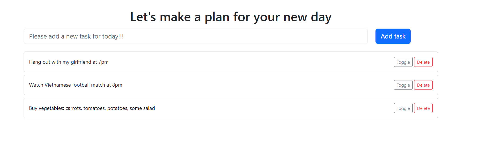

# TodoList
A simple application that helps you plan your day. Designed to be easy to read and easy to use.

## Features
- Add tasks: Add tasks that need to be completed.
- Remove tasks: Delete unnecessary tasks.
- Mark tasks as completed: Track progress by marking tasks as done.
  
## Technical details
- Language: Java21
- Framework: Spring boot 3
- UI: Thymeleaf (server-side template engine for rendering HTML)
- Additional tools: Docker, Postman 

